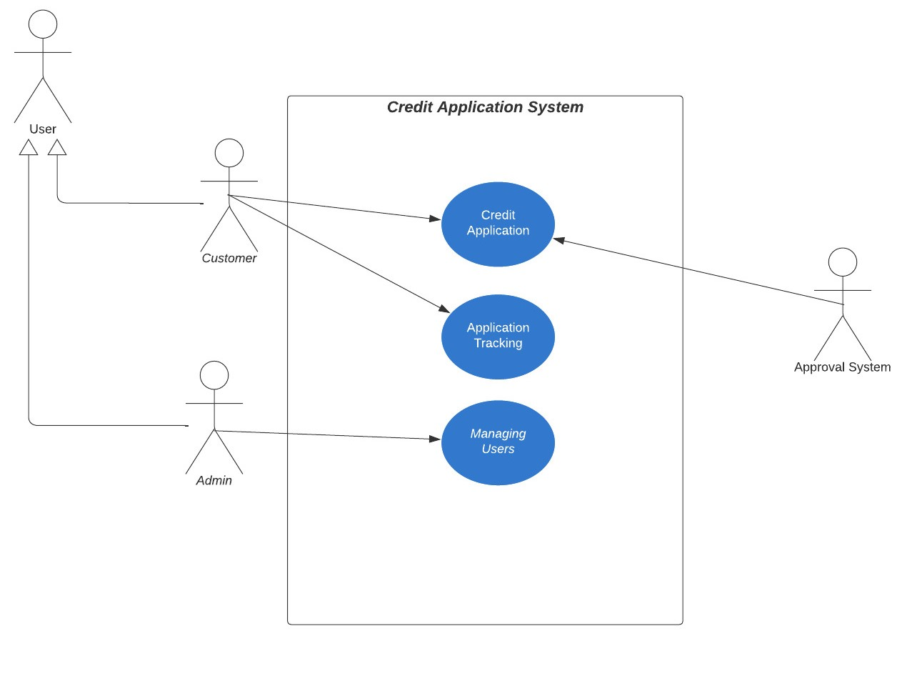

# Credit Application System

This project is a restful application that will take credit application
requests and return the result to the customer according to the 
relevant criteria

The user's identity number, name-surname, monthly income and telephone information are obtained, the credit score service is accessed with the identity number, and the credit score is obtained, also the credit result is displayed to the user.

# Used Technologies & Tools
- Java (Version:16)
- Java SDK (Version:18)
- Spring
- Intellij Idea
- Postman
- PgAdmin(PostgreSQL)
